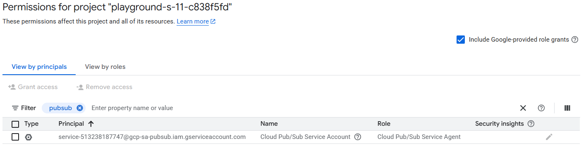

# Project Neptune
The New Entities, Passwords, Tests, Updates, Nulls and Exports (NEPTUNE) system is desired to better understand Moonbank rate-of-growth and administration overhead to manage Moonbank customers

## Project setup

```bash
gcloud services enable \
    dataflow.googleapis.com cloudfunctions.googleapis.com \
    run.googleapis.com cloudbuild.googleapis.com \
    eventarc.googleapis.com pubsub.googleapis.com \
    cloudbuild.googleapis.com containerregistry.googleapis.com
```

Make sure you see the pubsub robot account with the Pubsub Service Agent Role allocated, otherwise, disable and re-enable pubsub


## To deploy the sample code to a Cloud Function  
Requires a BigQuery Dataset named: Neptune  
Requires a Table named: rawmessages  
Requires a Schema:  message:string  

## Goals:  
Create a test topic  
Deploy the sample function sending csv data 
Parse the pub/sub messages into fields  
Create a new table in the neptune dataset with a matching schema  
Stream the rows into BigQuery  

To deploy the cloud function
```bash
gcloud functions deploy function_pb_bq --gen2 \
  --region=us-central1 \
  --runtime=python312 \
  --trigger-topic=neptune-activities \
  --entry-point=pubsub_to_bigquery \
  --memory=256MB 
  #--service-account=$(gcloud projects list --filter="PROJECT_ID=$DEVSHELL_PROJECT_ID" --format "value(PROJECT_NUMBER)")-compute@developer.gserviceaccount.com # Amend this line depending on whether you can use custom service accounts or not in your project
```

## Additional Goals:  
Parse the message and write into a new table in your Neptune Dataset  
  SCHEMA: id:string,ipaddress:string,action:string,accountnumber:string,actionid:integer,name:string,actionby:string    
  Example: 20200812040801981475,195.174.170.81,UPDATE,GB25BZMX47593824219489,4,Emily Blair,STAFF  

Build a Looker Studio Dashboard that reports on Database Activities    
